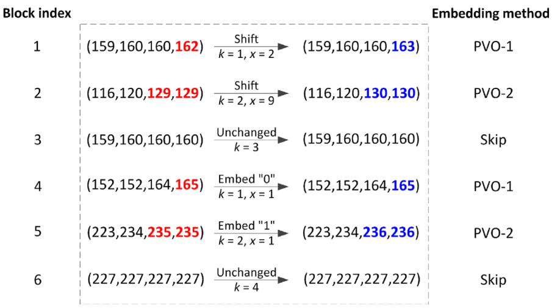
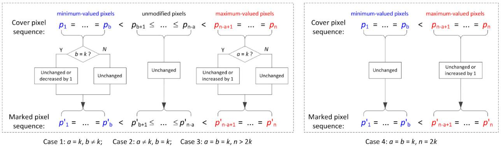
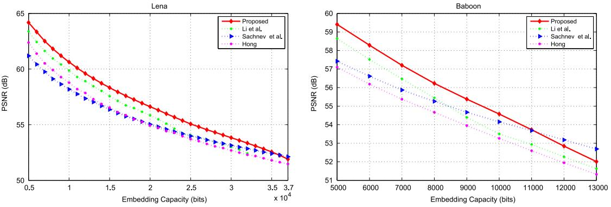
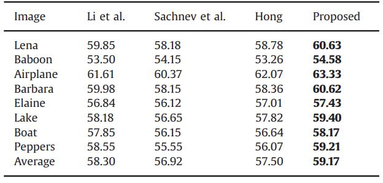

PVO-K
=======


论文题目： "[Reversible data hiding using invariant pixel-value-ordering and prediction-error expansion](https://www.sciencedirect.com/science/article/pii/S0923596514000824)" (SPIC 2014).


<p align="center">     </p>
<p align="center"> 图1: 混合PVO-1和PVO-2嵌入.</p>


<p align="center">     </p>
<p align="center"> 图2: PVO-k.</p>


## 如何运行

```
进入 code 文件夹
运行 main_K.m 文件
```

## 实验结果

<p align="center">     </p>
<p align="center"> 图3: 性能对比.</p>

<p align="center">     </p>
<p align="center"> 图4: PSNR对比.</p>


## 实验环境
Matlab 2016b <br>


## 引用格式
如果这项工作对您的研究有帮助, 请按如下格式引用：
```
@article{OU2014760,
title = {Reversible data hiding using invariant pixel-value-ordering and prediction-error expansion},
journal = {Signal Processing: Image Communication},
volume = {29},
number = {7},
pages = {760-772},
year = {2014},
issn = {0923-5965},
doi = {https://doi.org/10.1016/j.image.2014.05.003},
author = {Bo Ou and Xiaolong Li and Yao Zhao and Rongrong Ni},
}
```

## 版权声明
受欧博老师委托，本项目已开源 (详见 ``` MIT LICENSE ``` ).


